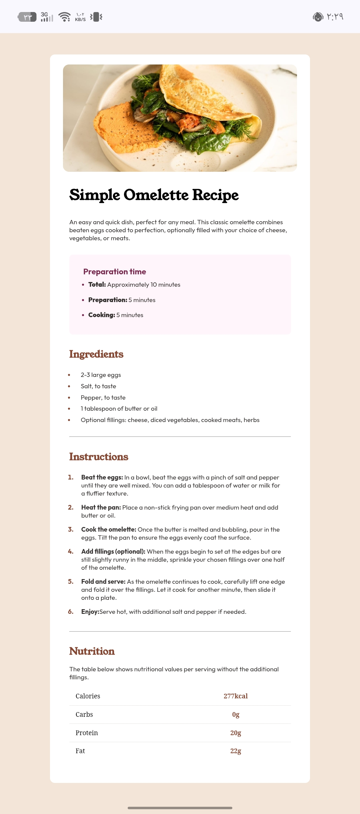

# Recipe Page - Solution

This is a solution to the [Recipe page challenge on Frontend Mentor](https://www.frontendmentor.io/challenges/recipe-page-ytLiTsizQc).

## 🚀 Live Demo
[View Live Site](https://d13hn.github.io/recipe-page-final/)

## 👋 Welcome!
I'm Hussein Alaa. This project was a significant milestone in my journey as a web developer. I built this recipe page to practice and solidify my understanding of front-end fundamentals.

## 🛠️ Built with
- Semantic HTML5 markup
- CSS custom properties (Variables)
- Mobile-first workflow
- Media Queries for responsive design

## ✨ What I learned
This challenge was a great opportunity to improve my skills. Here is what I focused on:
- **Semantic HTML:** Structuring the recipe page with meaningful tags to ensure better accessibility and SEO.
- **Responsive Design:** I mastered the use of **Media Queries** to ensure the layout looks perfect on both mobile devices and desktops.
- **Problem Solving:** I faced several challenges regarding spacing and alignment, but I managed to troubleshoot them effectively by refining my CSS rules.
- **Focus:** This challenge helped me sharpen my focus on detail and better understand the logic behind the design-to-code process.

## 💡 Continued development
In future projects, I aim to:
- Deepen my knowledge of CSS Grid for complex layouts.
- Continue improving my commit habits on GitHub to keep a clean project history.

## 🔗 Useful resources
- [Frontend Mentor](https://www.frontendmentor.io/) - A great platform for practicing front-end development.

---
**Happy coding!** 🚀

